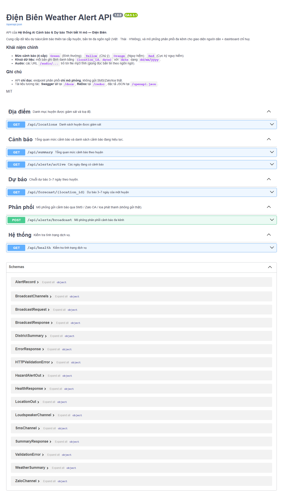

# Tài liệu API (Swagger / OpenAPI)

API của **Hệ thống AI Cảnh báo & Dự báo Thời tiết Vi mô — Điện Biên**. Đặc tả được sinh tự động từ code
(FastAPI), luôn đồng bộ với hệ thống.

## Truy cập tài liệu tương tác

Khởi động backend, sau đó mở trong trình duyệt:

```bash
uvicorn backend.presentation.api.app:app --reload    # http://localhost:8000
```

| Công cụ | URL | Mô tả |
|---|---|---|
| **Swagger UI** | http://localhost:8000/docs | Tài liệu tương tác, bấm **Try it out** để gọi thử |
| **ReDoc** | http://localhost:8000/redoc | Tài liệu dạng đọc, bố cục 3 cột |
| **OpenAPI JSON** | http://localhost:8000/openapi.json | Đặc tả máy đọc (đã kèm sẵn tại [`docs/openapi.json`](openapi.json)) |



## Thông tin chung

- **Base URL:** `http://localhost:8000`
- **Base path:** tất cả endpoint nghiệp vụ có tiền tố `/api`; audio phục vụ tĩnh tại `/audio/...`
- **Định dạng:** JSON, `Content-Type: application/json`
- **Xác thực:** không (API demo, chỉ đọc)
- **CORS:** cho phép `http://localhost:5173` (frontend Vite)

### Mức cảnh báo (4 cấp)
`Green` (Bình thường) · `Yellow` (Chú ý) · `Orange` (Nguy hiểm) · `Red` (Cực kỳ nguy hiểm).
Ưu tiên: **Red > Orange > Yellow > Green**.

### Khoá dữ liệu
Mỗi bản ghi định danh bằng `(location_id, date)`, với `date` dạng `dd/mm/yyyy`.
`location_id` hợp lệ: `muong_nhe`, `muong_cha`, `tuan_giao`.

## Danh sách endpoint

| Method | Đường dẫn | Nhóm | Mô tả |
|---|---|---|---|
| `GET` | `/api/locations` | Địa điểm | Danh sách huyện + toạ độ |
| `GET` | `/api/summary` | Cảnh báo | Mức cảnh báo cao nhất theo huyện + đếm KPI |
| `GET` | `/api/alerts/active` | Cảnh báo | Các ngày đang có cảnh báo (mức ≥ Vàng) |
| `GET` | `/api/forecast/{location_id}` | Dự báo | Dự báo 3–7 ngày của một huyện |
| `POST` | `/api/alerts/broadcast` | Phân phối | Mô phỏng gửi SMS / Zalo OA / loa (không gửi thật) |
| `GET` | `/api/health` | Hệ thống | Kiểm tra tình trạng dịch vụ |

## Ví dụ nhanh (cURL)

```bash
# Tổng quan mức cảnh báo theo huyện
curl http://localhost:8000/api/summary

# Dự báo 7 ngày của huyện Mường Nhé
curl http://localhost:8000/api/forecast/muong_nhe

# Mô phỏng phân phối cảnh báo đa kênh
curl -X POST http://localhost:8000/api/alerts/broadcast \
  -H "Content-Type: application/json" \
  -d '{"location_id":"muong_nhe","date":"20/07/2026","channels":["sms","zalo","loudspeaker"]}'
```

## Chi tiết một số endpoint

### `GET /api/summary`
Trả về mức cảnh báo cao nhất hiện tại của từng huyện (tô màu bản đồ) và số huyện theo từng mức (KPI).

```jsonc
{
  "districts": [
    {
      "location_id": "muong_nhe", "location": "Huyện Mường Nhé",
      "latitude": 22.1989, "longitude": 102.4481, "elevation": 900,
      "highest_alert_level": "Red", "level_label": "Cực kỳ nguy hiểm"
    }
  ],
  "counts": { "Green": 0, "Yellow": 0, "Orange": 2, "Red": 1 }
}
```

### `GET /api/forecast/{location_id}`
Chuỗi dự báo theo ngày (tăng dần). Mỗi phần tử là một `AlertRecord` gồm số liệu thời tiết,
danh sách hiểm họa, bản tin đa ngôn ngữ và URL audio.
- **404** nếu `location_id` không tồn tại.
- Ngày chưa có bản dịch: `messages` rỗng và `has_translation = false` (suy giảm mềm).

### `POST /api/alerts/broadcast`
**Mô phỏng** nội dung phân phối (không gửi thật). Body:

```json
{ "location_id": "muong_nhe", "date": "20/07/2026", "channels": ["sms", "zalo", "loudspeaker"] }
```

Phản hồi gồm `channels` chỉ chứa các kênh được yêu cầu; mỗi kênh có nội dung dựng sẵn từ dữ liệu thực
(SMS có mã cảnh báo emoji, thẻ Zalo OA, audio loa phát thanh). Trường `simulated` luôn `true`.
- **404** nếu không có bản ghi cho `(location_id, date)`.

## Mã lỗi

| Mã | Ý nghĩa |
|---|---|
| `200` | Thành công |
| `404` | Không tìm thấy địa điểm / bản ghi (thân lỗi: `{ "detail": "..." }`) |
| `422` | Body/tham số không hợp lệ (FastAPI validation) |

> Xem đầy đủ schema request/response và bấm gọi thử tại **Swagger UI** (`/docs`).
