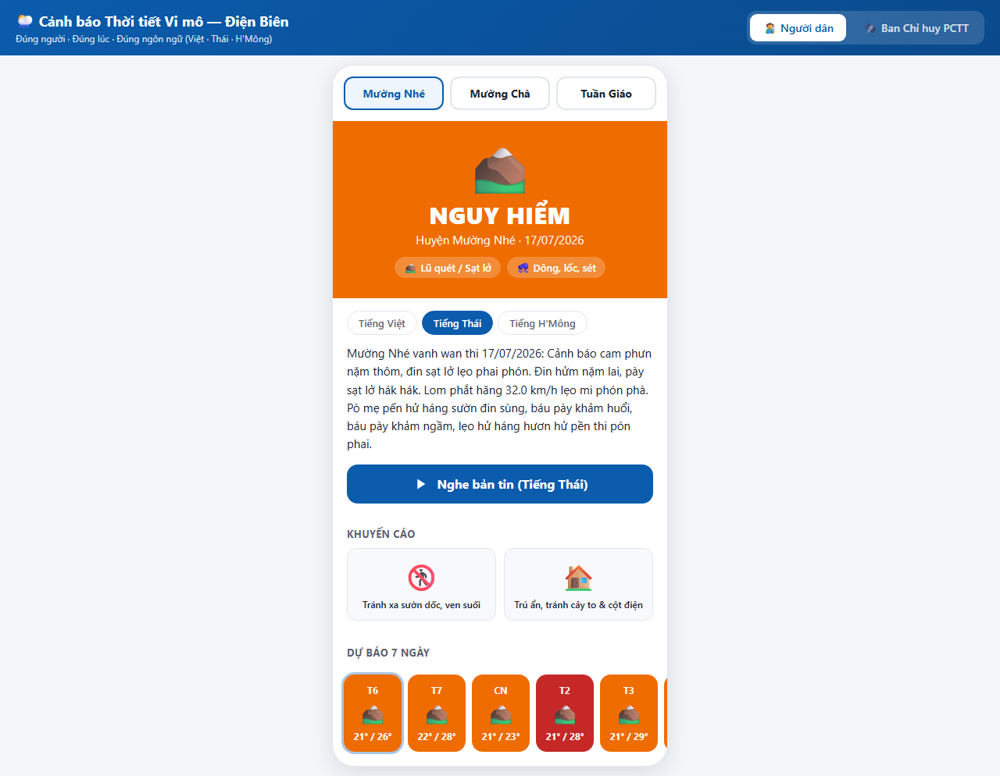
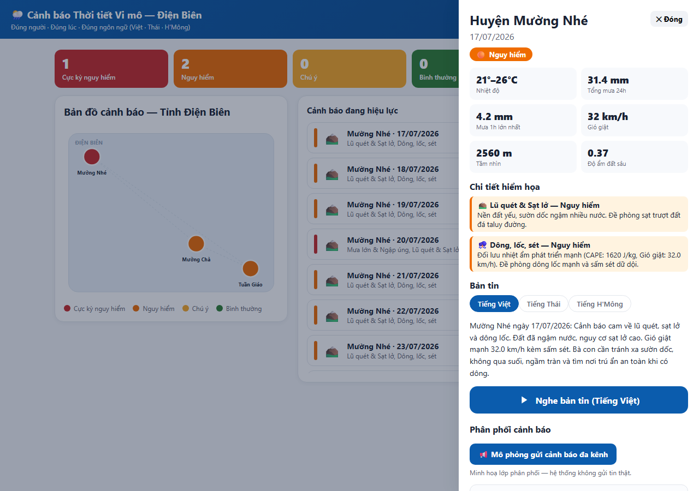

# HỒ SƠ DỰ THI — Vietnam AI Innovation Challenge

## Hệ thống AI Cảnh báo & Dự báo Thời tiết Vi mô cho Điện Biên
### *"Đúng người – Đúng lúc – Đúng ngôn ngữ"*

> Dự báo thiên tai chi tiết đến cấp huyện/cụm bản, tự động sinh bản tin cảnh báo,
> dịch sang **tiếng Thái và tiếng H'Mông**, và truyền tải bằng **màu sắc – biểu tượng – giọng nói**
> để **cả người không đọc được chữ cũng hiểu được mức nguy hiểm**.

---

## 1. Tóm tắt (Executive Summary)

Ở vùng núi cao như Điện Biên, thời tiết cực đoan (lũ quét, sạt lở, rét hại, sương muối, sương mù, dông lốc) diễn ra **nhanh và cục bộ**, nhưng dự báo hiện chỉ dừng ở **cấp tỉnh** — đến chậm, chung chung, và trình bày bằng thuật ngữ khí tượng mà **đồng bào dân tộc thiểu số khó tiếp cận**.

Chúng tôi xây dựng một **pipeline AI 4 lớp** biến dữ liệu thời tiết thô thành **cảnh báo hành động cụ thể, đa ngôn ngữ, đa kênh**:

1. **Hạ độ phân giải (downscaling)** dữ liệu cấp tỉnh → cấp huyện/cụm bản theo địa hình.
2. **Phát hiện rủi ro tự động** bằng bộ quy tắc ngưỡng đã hiệu chỉnh (7 nhóm hiểm họa, 4 mức).
3. **AI ngôn ngữ (LLM)** sinh bản tin tiếng Việt chuẩn mực, dịch sang tiếng Thái (Tai Dam/Tai Don) và H'Mông, kèm **giọng đọc (TTS)**.
4. **Phân phối đa kênh**: Web/Dashboard, mô phỏng SMS · Zalo OA · loa phát thanh xã.

Sản phẩm đã chạy end-to-end với **3 huyện × 7 ngày**, có **giao diện người dân + dashboard chỉ huy**, và bộ **benchmark đo chất lượng thuật toán** (POD/FAR/CSI).

---

## 2. Bối cảnh & Vấn đề

Điện Biên có địa hình chia cắt mạnh, độ cao chênh lệch lớn giữa các xã trong cùng một huyện. Hệ quả:

- **Dự báo cấp tỉnh không phản ánh đúng vi khí hậu từng xã**: một bản dưới lòng chảo và một bản trên cao nguyên đá có thể chênh nhau nhiều độ C, khác biệt hoàn toàn về nguy cơ rét hại/sương muối.
- **Thông tin đến chậm và khó hiểu**: bản tin khí tượng dùng thuật ngữ ("CAPE", "mực đông lạnh", "lượng mưa 24h"…) mà người dân khó chuyển thành hành động.
- **Rào cản ngôn ngữ & chữ viết**: nhiều đồng bào Thái, H'Mông không đọc thạo tiếng phổ thông; một bộ phận không đọc được chữ.
- **Vùng lõm sóng**: nhiều bản không có Internet ổn định để nhận cảnh báo qua app.

**Hệ quả thực tế**: cảnh báo lũ quét/sạt lở/rét hại thường đến sau khi thiệt hại đã xảy ra, đặc biệt với nhóm dễ tổn thương nhất.

> **Người dùng đích:**
> 1. **Hộ dân / nông dân vùng cao** — cần biết "hôm nay có nguy hiểm không, phải làm gì".
> 2. **Cán bộ xã/bản, Ban Chỉ huy PCTT** — cần giám sát tổng thể và ra quyết định phát cảnh báo.
> 3. **Người đi đường / vận tải** — cần cảnh báo sương mù, sạt lở trên các cung đèo.

---

## 3. Giải pháp & Điểm khác biệt

### 3.1 Kiến trúc pipeline 4 lớp

```
Open-Meteo API
   └─(1) Hạ độ phân giải theo địa hình (lapse rate) → dự báo cấp xã
        └─(2) Rule Engine 7 hiểm họa × 4 mức (ngưỡng cấu hình, đã hiệu chỉnh)
             └─(3) LLM sinh bản tin + dịch Việt→Thái→H'Mông + TTS giọng nói
                  └─(4) Phân phối: Dashboard · SMS · Zalo OA · Loa phát thanh xã
```

### 3.2 Ba điểm khác biệt cốt lõi

| # | Điểm khác biệt | Vì sao quan trọng |
|---|---|---|
| **1** | **Dự báo vi mô cấp huyện/cụm bản** thay vì cấp tỉnh, hiệu chỉnh nhiệt độ theo độ cao thực của từng xã | Bắt được rét hại/sương muối cục bộ mà dự báo tỉnh bỏ sót |
| **2** | **Cảnh báo đa ngôn ngữ dân tộc + giọng nói** (Thái Tai Dam/Tai Don, H'Mông RPA), có ràng buộc chống bịa số liệu | Xoá rào cản ngôn ngữ & mù chữ — nhóm dễ tổn thương nhất được phục vụ |
| **3** | **Giao diện "không cần đọc chữ"**: thang 4 màu + biểu tượng hiểm họa + pictogram hành động | Người dân hiểu mức nguy hiểm và việc cần làm chỉ trong 3 giây |

---

## 4. AI được ứng dụng như thế nào?

Đây là dự án AI *ứng dụng nhiều kỹ thuật*, không chỉ gọi một API:

- **Statistical downscaling (địa thống kê):** hiệu chỉnh nhiệt độ mô hình lưới thô về độ cao thực của từng xã bằng gradient khí quyển (lapse rate 0.65°C/100m). Mọi quyết định cảnh báo rét/sương muối dựa trên giá trị đã hiệu chỉnh.
- **Rule-based hazard model (hệ chuyên gia):** 7 nhóm hiểm họa, mỗi nhóm 3 mức (Vàng/Cam/Đỏ), ngưỡng tách khỏi logic để cấu hình được; điểm rủi ro sạt lở là **công thức tổng hợp** mưa + độ ẩm đất sâu + cân bằng nước, nhân hệ số rủi ro từng huyện.
- **LLM (sinh & dịch ngôn ngữ tự nhiên):** sinh bản tin tiếng Việt chuẩn mực rồi dịch sang **ngôn ngữ ít tài nguyên** (Thái Điện Biên, H'Mông) — bài toán khó vì thiếu dữ liệu huấn luyện. Prompt áp **ràng buộc chống ảo giác nghiêm ngặt**: không đổi số liệu, không đổi mức cảnh báo, không thêm hiện tượng ngoài dữ liệu. Có vòng lặp kiểm định + retry.
- **TTS (khả năng tiếp cận):** chuyển bản tin thành giọng nói để phục vụ người không đọc được chữ và kênh loa phát thanh.

> **Kiến trúc AI có thể thay thế được (pluggable):** tầng LLM giao tiếp qua interface (port) nên có thể đổi nhà cung cấp mô hình mà không sửa nghiệp vụ.

### Đo lường chất lượng (rất quan trọng với giám khảo)
Chúng tôi không "nói suông" về độ chính xác. Bộ `benchmark` chạy **10 kịch bản lịch sử có nhãn** và báo cáo các **chỉ số kỹ năng dự báo khí tượng chuẩn**:

| Chỉ số | Ý nghĩa | Kết quả demo |
|---|---|---|
| **POD** | Xác suất phát hiện đúng thiên tai | **100%** |
| **FAR** | Tỷ lệ báo động giả | 25% |
| **CSI** | Chỉ số thành công cốt lõi | 75% |
| **Accuracy** | Độ chính xác tổng thể | 96.2% |

*(Chạy `python -m backend.presentation.benchmark` để tái lập.)*

---

## 5. Demo

| Màn hình Người dân | Dashboard Ban Chỉ huy PCTT |
|---|---|
|  |  |

- **Người dân:** chọn huyện → banner màu lớn + biểu tượng + trạng thái một từ ("NGUY HIỂM") → bản tin + **nút nghe giọng nói** (Việt/Thái/H'Mông) → pictogram khuyến cáo → dải dự báo 7 ngày tô màu.
- **Ban Chỉ huy PCTT:** bản đồ cảnh báo, danh sách hiểm họa đang hiệu lực, chi tiết số liệu, và **mô phỏng phân phối đa kênh** (SMS/Zalo/loa — không gửi thật).

**Kịch bản trình diễn 3 phút:** (1) mở màn Người dân huyện Mường Nhé đang mức Đỏ → nghe bản tin tiếng H'Mông; (2) chuyển Dashboard → click ngày cảnh báo Đỏ → xem số liệu → bấm "Mô phỏng gửi cảnh báo" thấy tin SMS/Zalo/loa; (3) chạy `benchmark` chiếu chỉ số POD/FAR/CSI.

---

## 6. Tác động xã hội

Đây là dự án **"không để ai bị bỏ lại phía sau"** trong phòng chống thiên tai:

- **Bảo vệ nhóm dễ tổn thương nhất**: đồng bào dân tộc thiểu số, người không đọc được chữ, vùng lõm sóng.
- **Giảm thiệt hại người & tài sản**: cảnh báo sớm + hành động cụ thể (không qua ngầm tràn, tránh sườn dốc, chống rét cho cây trồng/vật nuôi).
- **Trao quyền cho cán bộ cơ sở**: dashboard giúp trưởng bản/cán bộ xã ra quyết định nhanh.
- **Phù hợp định hướng quốc gia**: chuyển đổi số trong PCTT, bình đẳng số cho vùng dân tộc, gắn với các Mục tiêu Phát triển Bền vững (SDG 11 & 13).

---

## 7. Tính khả thi, chi phí & Mở rộng

- **Chạy được ngay, chi phí gần như bằng 0**: dùng **Open-Meteo (miễn phí)**; pipeline dự báo chỉ dùng thư viện chuẩn Python; backend/frontend nhẹ, deploy được trên free tier.
- **Mở rộng dễ**: kiến trúc phân lớp (Clean Architecture) — thêm hiểm họa, ngôn ngữ, nguồn dữ liệu hay kênh phân phối đều nằm gọn trong một lớp.

**Lộ trình sau hackathon:**

| Giai đoạn | Mục tiêu |
|---|---|
| **Pilot (T1–3)** | Thử nghiệm 1 huyện trọng điểm, kết nối Đài KTTV Điện Biên lấy số liệu trạm thực, lập Zalo OA với 5–10 xã |
| **Hiệu chỉnh (T3–6)** | Thu phản hồi đúng/sai từ thực địa, hiệu chỉnh mô hình bằng quan trắc thực, mở rộng toàn tỉnh |
| **Đa ngôn ngữ chính thức (T4–7)** | Hợp tác giáo viên song ngữ chuẩn hoá từ vựng cảnh báo tiếng Thái/H'Mông |
| **Loa xã & SMS (T6–12)** | Tích hợp truyền thanh thông minh; ký hợp đồng nhà mạng cho SMS/cell broadcast khẩn cấp |

---

## 8. Rủi ro & Giảm thiểu

| Rủi ro | Giảm thiểu |
|---|---|
| **Dịch sai tiếng dân tộc** gây hiểu lầm nguy hiểm | **Bắt buộc người bản ngữ kiểm duyệt** trước khi phát chính thức; prompt cấm đổi số liệu/mức độ |
| **Báo động giả** làm giảm lòng tin | Đo POD/FAR/CSI, hiệu chỉnh ngưỡng liên tục bằng dữ liệu thực |
| **Vùng lõm sóng** không nhận được cảnh báo | Ưu tiên kênh loa phát thanh; phối hợp trưởng bản |
| **Phụ thuộc API miễn phí** | Cache dữ liệu + nguồn dự phòng (OpenWeatherMap, trạm KTTV) |

---

## 9. Đội ngũ

> *(Điền thông tin thành viên — mô hình 6 vai trò đã áp dụng)*

| Vai trò | Trách nhiệm |
|---|---|
| Trưởng nhóm / PO kiêm UX | Định hướng sản phẩm, thiết kế thang màu/icon, làm việc với "khách hàng" giả định |
| Data Engineer | Kết nối API thời tiết, chuẩn hoá dữ liệu, geo-mapping xã/bản |
| Forecast/ML Engineer | Downscaling, rule engine, hiệu chỉnh bằng dữ liệu lịch sử |
| AI/NLP Engineer | Prompt engineering, pipeline dịch đa ngôn ngữ, TTS |
| Backend/Integration & DevOps | API, tích hợp Zalo/SMS/loa, triển khai hạ tầng |
| QA & Frontend | Xây giao diện theo wireframe, kiểm thử độ dễ hiểu & ngưỡng cảnh báo |

---

## 10. Đối chiếu tiêu chí chấm điểm

| Tiêu chí | Dự án đáp ứng |
|---|---|
| **Tính sáng tạo** | Dự báo vi mô + cảnh báo đa ngôn ngữ dân tộc + giao diện không cần đọc chữ |
| **Ứng dụng AI** | Downscaling + hệ chuyên gia + LLM sinh/dịch + TTS; có benchmark đo lường |
| **Tác động xã hội** | Phục vụ nhóm dễ tổn thương nhất trong PCTT; gắn SDG 11 & 13 |
| **Tính khả thi & mở rộng** | Chạy ngay, chi phí thấp, kiến trúc phân lớp, có lộ trình pilot rõ ràng |
| **Hoàn thiện kỹ thuật** | End-to-end, có test, Clean Architecture, dashboard + giao diện dân |
| **Trình bày** | Giao diện trực quan, có demo, deck 1 trang, tài liệu kiến trúc đầy đủ |

---

## 11. Kết luận

Thiên tai ở vùng cao không chờ ai. Giải pháp của chúng tôi biến dữ liệu thời tiết khô khan thành **một câu trả lời đơn giản mà bất kỳ ai cũng hiểu: hôm nay có nguy hiểm không, và phải làm gì** — bằng đúng ngôn ngữ của họ, qua đúng kênh họ tiếp cận được. Đó là AI phục vụ những người cần nó nhất.

**Tài liệu liên quan:** [README](../README.md) · [Kiến trúc chi tiết](architecture.md) · [Deck 1 trang](deck-1page.html)
